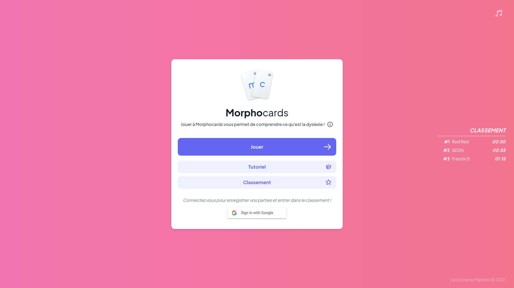
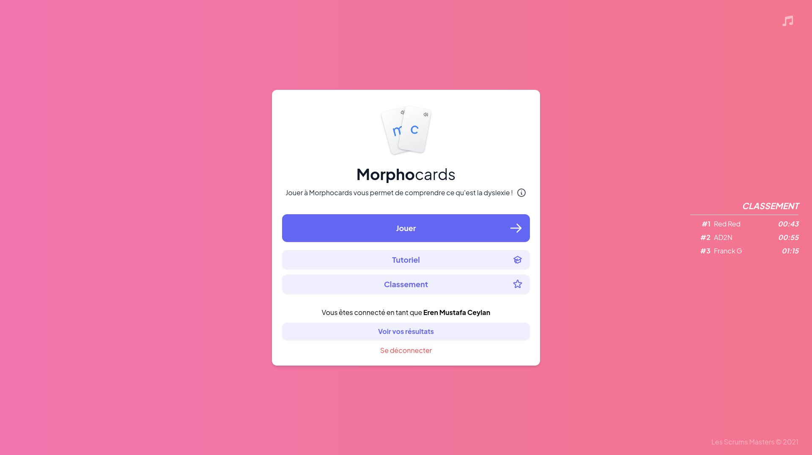
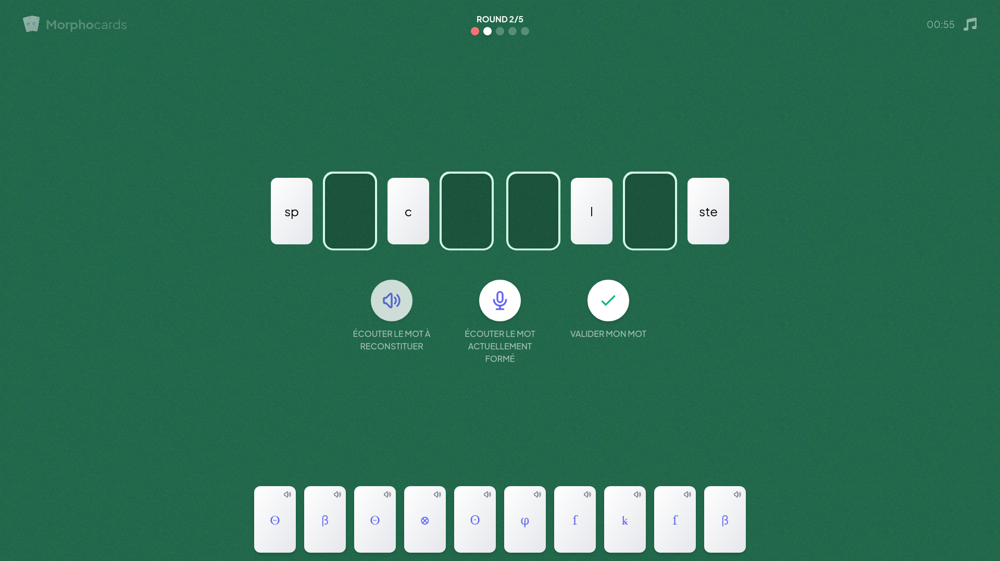
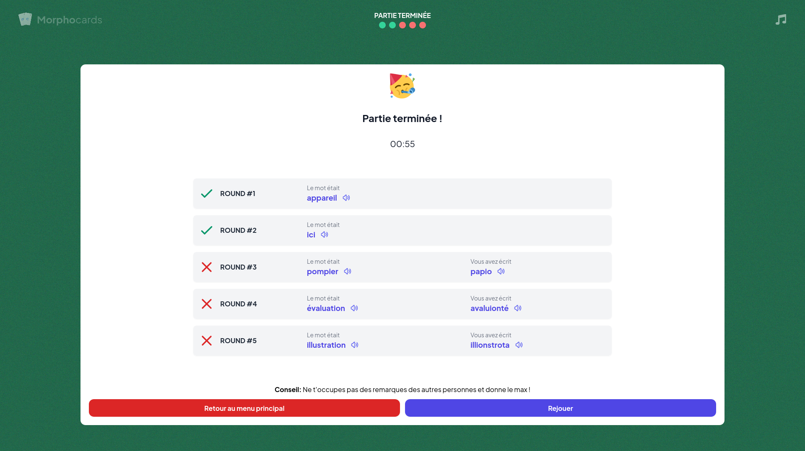
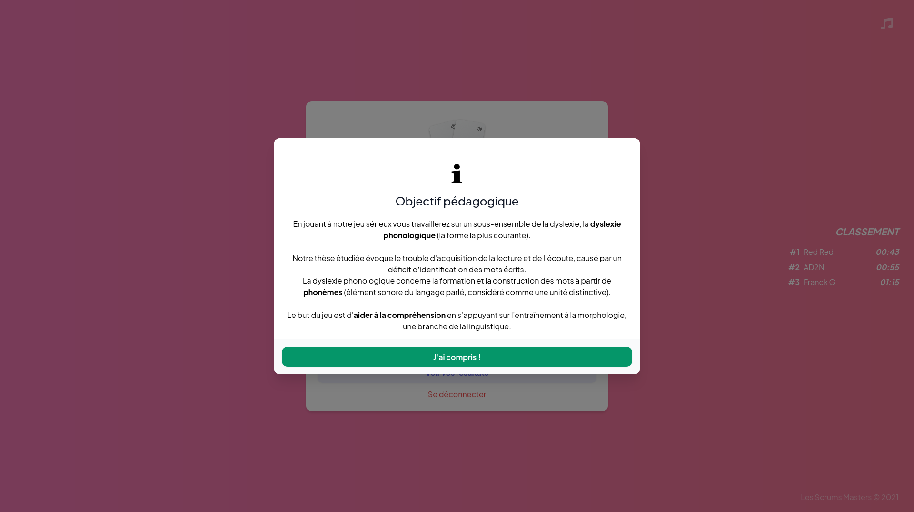
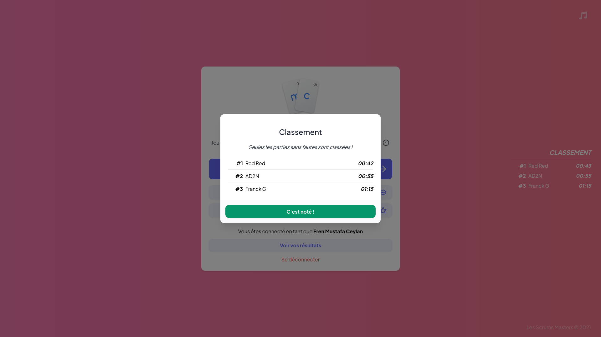
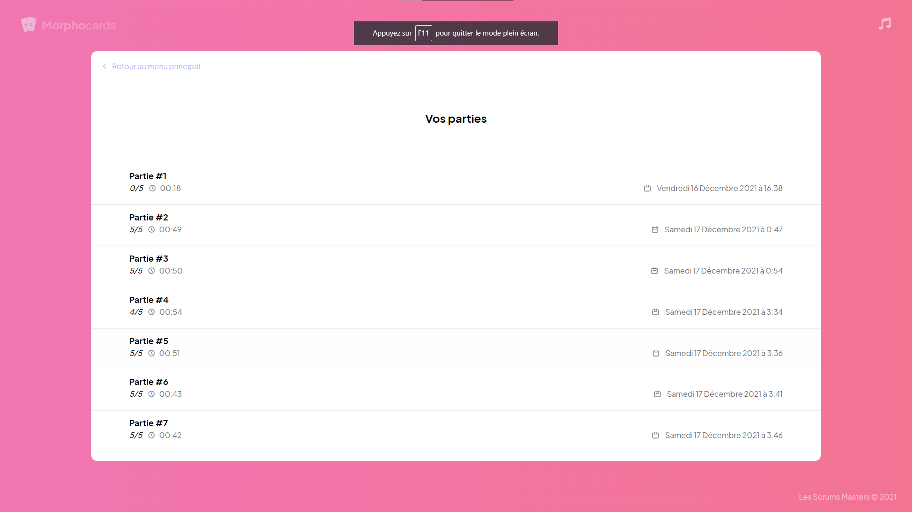
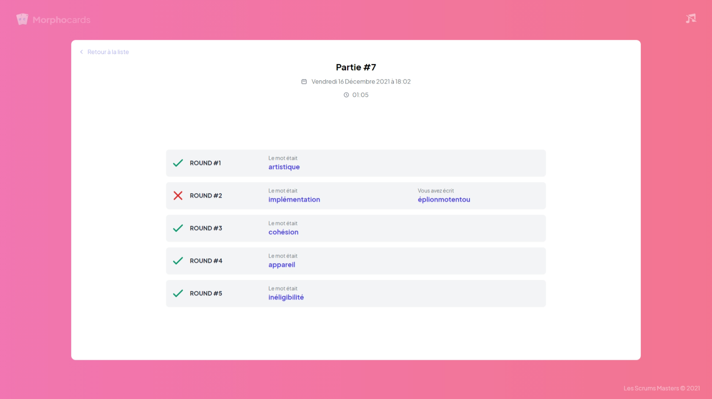
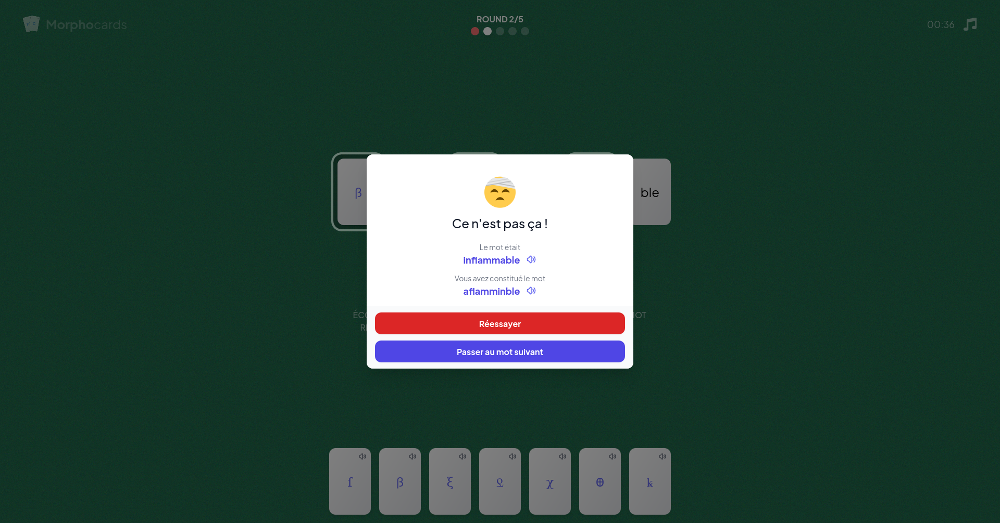
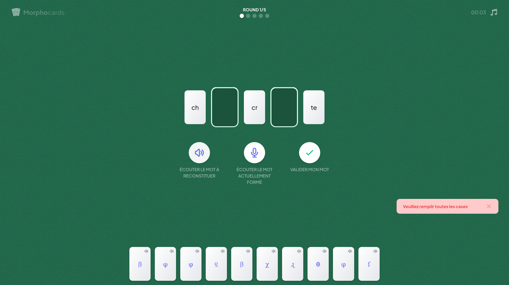

# FOC21-T3-A : Les Scrums Masters 🕵️

## **👨 Membres du groupes**

    * CEYLAN Eren Mustafa
    * MANSOURI Sofiane
    * GUTMANN Franck

## **Jouer**

Pour vous amusez, il suffit simplement d'aller sur le site : **[Morphocards](http://morphocards.franck-g.fr/)**


## **🛠️ Installation en local**

### **Prérequis :**

- [Node.js](https://nodejs.org/) (min v16)
- [npm](http://www.npmjs.com)

### **1. Cloner le repos :**

```bash
git clone https://git.unistra.fr/les-scrums-masters/foc21-t3-a.git
```

### **2. Installer les dépendances Node.js :**

Au sein du dossier `/morphocards`, executer la commande
```bash
npm install
```

### **3. Demarrer le serveur Node.js :**

Au sein du dossier `/morphocards`, executer la commande
```bash
npm run start
```

L'application est alors disponible depuis un navigateur à l'adresse [http://localhost:3000/](http://localhost:3000/)


## **📃 Description du jeu**

MorphoCards est un jeu sérieux ludique qui a pour vocation de faire ***comprendre ce qu'est la dyslexie.***


Il s'agit d'un jeu de cartes visuel. Le joueur se retrouvera avec une main de 10 cartes constituée de symboles représentant différents phonèmes. Le plateau de jeu, lui, contiendra une ou plusieurs cartes représentant différentes parties d'un mot, que le joueur devra compléter à l'aide des cartes de sa main. Lors de chaque manche, le joueur entendra le mot à compléter, et pourra le réécouter autant qu'il le souhaite. Le but du joueur sera donc de reconstituer le mot entendu à l'aide des cartes de sa main.

Un clic sur une carte de sa main lui permettra d'écouter le son qu'elle représente. Si le joueur complète correctement le mot, il passe à la manche suivante. Sinon, il peut soit réesayer autant de fois qu'il le souhaite jusqu'à reussir à réconstituer le bon soit passer au prochain mot.

Une partie se déroulera en 5 tours. L'objectif est de terminer la partie avec le meilleur temps possible.

Le joueur pourra donc se mettre à la place d'une personne dyslexique qui interprète les mots d'une manière différente.

À la fin, le joueur pourra voir le récapitulatif de sa partie.


## **📷 Galerie**

<table>
    <thead>
        <tr>
            <th>Menu principal (Déconnecté)</th>
            <th>Menu principal (Connecté)</th>
        </tr>
    </thead>
    <tbody>
        <tr>
            <td></td>
            <td></td>
        </tr>
    </tbody>
     <thead>
        <tr>
            <th>Menu de jeu</th>
            <th>Menu de fin</th>
        </tr>
    </thead>
    <tbody>
        <tr>
            <td></td>
            <td></td>
        </tr>
    </tbody>
    <thead>
        <tr>
            <th>Objectif pédagogique</th>
            <th>Classement</th>
        </tr>
    </thead>
    <tbody>
        <tr>
            <td></td>
            <td></td>
        </tr>
    </tbody>
    <thead>
        <tr>
            <th>Vue de toutes ses manches</th>
            <th>Vue d'une seule manche</th>
        </tr>
    </thead>
    <tbody>
        <tr>
            <td></td>
            <td></td>
        </tr>
    </tbody>
    <thead>
        <tr>
            <th>Vue lors d'une validation de mot</th>
            <th>Avertissement pour l'utilisateur</th>
        </tr>
    </thead>
    <tbody>
        <tr>
            <td></td>
            <td></td>
        </tr>
    </tbody>
</table>


## Information supplémentaire
-  [WIKI](https://git.unistra.fr/les-scrums-masters/foc21-t3-a/-/wikis/home)
- [DOCS](http://morphocards-docs.franck-g.fr/)
