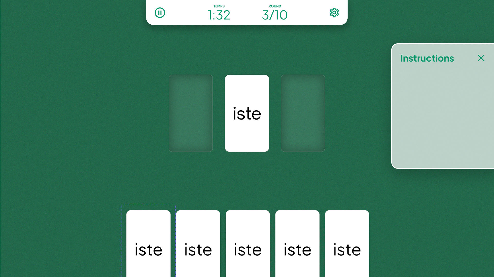

# FOC21-T3-A : Les Scrums Masters 🕵️‍♂️

## **🧑🏽 Membres du groupes**

    * CEYLAN Eren Moustafa
    * MANSOURI Sofiane
    * GUTMANN Franck

## **✅ Objectif pédagogique général**

Notre jeu sérieux se base sur une stratégie d’apprentissage par lecture, avec composition de mots à partir de morphèmes (plus petites unités de sens).
Son but est d'aider et de faciliter l’apprentissage des mots aux personnes dyslexiques en s’appuyant sur l'entraînement à la morphologie, une branche de la linguistique. L'entraînement à la morphologie consiste en l'étude des morphèmes.
Nous allons plus précisément nous appuyer sur la morphologie dérivationelle. Elle concerne la formation et la construction des mots à partir de préfixes, suffixes et radicaux.
La morphologie dérivationelle permet par exemple de : lire plus vite, lire plus précisément, mieux orthographier les mots ou bien de déduire la signification de mots inconnus et de développer son vocabulaire.

## **📃 Description du jeu**

MorphoCard est un jeu sérieux ludique qui a pour vocation d’aider à l’apprentissage des mots aux personnes dyslexiques.

Il s'agit d'un jeu de cartes visuel. Le joueur se retrouve avec une main de X cartes constituée de préfixes ou de suffixes. Le plateau de jeu, lui, contient une seule carte représentant le radical, que le joueur devra compléter à l'aide d'une des cartes de sa main.
Le but du joueur est donc de trouver le mot correspondant le plus rapidement possible.
Une partie se déroule en 10 tours (par défaut). Il faut terminer la partie le plus rapidement possible. Chaque mauvaises réponses ajoutent une pénalité de temps.
A chaque fin de tour, le joueur aura connaissance de ses erreurs dans un but pédagogique et de ses bonnes décisions afin de pouvoir progresser.

