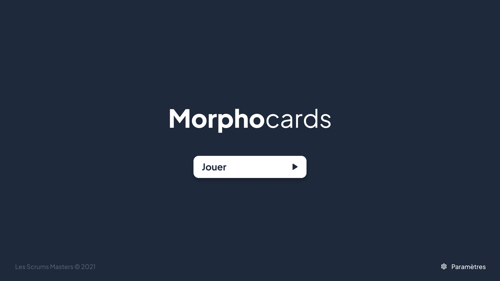

# FOC21-T3-A : Les Scrums Masters 🕵️

## **👨 Membres du groupes**

    * CEYLAN Eren Mustafa
    * MANSOURI Sofiane
    * GUTMANN Franck

## **✅ Objectif pédagogique général**

Notre jeu sérieux se base sur une compréhension de la dyslexie par la méthode de dyslexie phonologique, par lecture et par écoute, avec composition de mots à partir de morphèmes (plus petites unités de sens). Son but est d'aider à la compréhension de la dyslexie en s’appuyant sur l'entraînement à la morphologie, une branche de la linguistique.
Notre thèse étudiée évoque le trouble d'acquisition de la lecture, causé par un déficit d'identification des mots écrits.
L'entraînement à la morphologie consiste en l'étude des morphèmes, permettant le développement de la littératie (savoir bien lire et écrire).
Nous allons plus précisément nous appuyer sur la dyslexie phonologique. Elle concerne la formation et la construction des mots à partir de phonèmes (élément sonore du langage parlé, considéré comme une unité distinctive). La composition par phonèmes permet entre autres d'avoir une lecture efficiente.

## **📃 Description du jeu**

MorphoCards est un jeu sérieux ludique qui a pour vocation de faire comprendre ce qu'est la dyslexie.

Il s'agit d'un jeu de cartes visuel. Le joueur se retrouvera avec une main de X cartes constituée de symboles représentant différents phonèmes. Le plateau de jeu, lui, contiendra une ou plusieurs cartes représentant différentes parties d'un mot, que le joueur devra compléter à l'aide des cartes de sa main. Lors de chaque manche, le joueur entendra le mot à compléter, et pourra le réécouter autant qu'il le souhaite. Le but du joueur sera donc de reconstituer le mot entendu à l'aide des cartes de sa main.

Un clic sur une carte de sa main lui permettra d'écouter le son qu'elle représente. Si le joueur complète correctement le mot, il passe à la manche suivante. Sinon, il peut réesayer autant de fois qu'il le souhaite, mais il peut demander la correction après avoir fait au moins une erreur.

Une partie se déroulera en 10 tours. L'objectif est de terminer la partie avec le meilleur temps possible. À chaque fois que le joueur demande une correction, une pénalité de temps sera ajoutée. 

Le joueur pourra donc se mettre à la place d'une personne dyslexique qui interprète un mot d'une manière différente.

